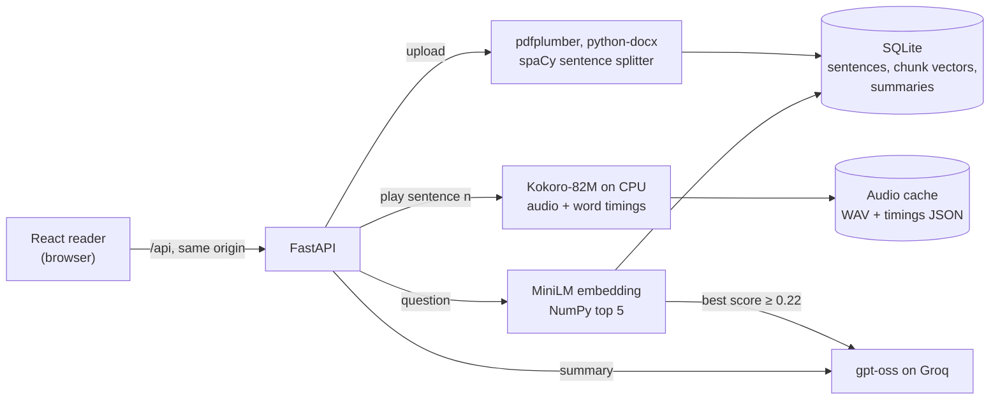

# VoxDoc

VoxDoc reads PDF and Word documents aloud in the browser and highlights each word as it's
spoken. It also summarises a document and answers questions about it, with citations that
jump to the sentence they cite. It's for people who would rather listen to a paper or
report than read it on a screen. Speech is generated on the CPU, with no GPU and no paid
speech API.

<!-- Live demo: add the link here once it's hosted. -->

<!-- Demo GIF, ~20 s, under 10 MB: uncomment once docs/demo.gif exists.

-->

<!-- Demo video with sound: drag the MP4 into this spot in GitHub's README editor. -->

## What it does

- **Upload** a PDF or Word file (up to 20 MB and 150 pages) and read it in a clean reader.
- **Listen** in 7 voices, American and British, at 0.5–2× speed, with the spoken word highlighted.
- **Summarise** a document into an overview and up to 5 key points.
- **Ask questions** and get answers with citations; clicking one jumps to that sentence and plays it.

## How it works



Five decisions shaped it:

1. **Synthesis one sentence at a time, with prefetching.** Kokoro needs about 0.3 s of CPU
   time per second of speech on this laptop, so rendering a 15-page paper before playing
   would take minutes. Each request synthesises one sentence and caches it on disk, keyed by
   text, voice and speed; while a sentence plays, the player fetches the next one, and it
   fetches the first one as soon as a document opens. The gap between sentences is 39 ms
   (median) with prefetch and 2.4 s without.
2. **Word timings aligned to the text on the server.** Kokoro times its own tokens, which
   don't match the displayed text: "3.5%", "U.S.", punctuation, and words it occasionally
   drops. The backend maps each timed word to character offsets in the sentence (counted
   the way JavaScript counts them), so the browser only has to look up the word at
   `audio.currentTime` on each animation frame. All 1,693 words in the test texts aligned,
   and the highlight trails the audio by 11 ms on average.
3. **Citations checked against what the model was actually shown.** A question retrieves
   the 5 most similar chunks. If the best score is below 0.22, VoxDoc answers "not found"
   without calling the LLM at all (on-topic questions scored ≥ 0.277, off-topic ≤ 0.166).
   The sentences sent are numbered `[S12]`; any citation in the answer that wasn't among
   them is dropped and logged, so a citation always points at text the model read.
4. **Summaries that fit Groq's free tier of 8,000 tokens per minute.** A summary is one
   request of at most about 5,000 input tokens and 1,200 output tokens. A longer document
   is summarised from excerpts: the first two chunks, the last, and evenly spaced chunks in
   between, with gaps marked. Choosing excerpts with MMR was also measured; it spent less
   of the budget on the reference list but covered the rest of the document less well, so
   even spacing is shipped.
5. **NumPy instead of a vector database.** A document has a few hundred chunks at most,
   stored as float32 vectors in the same SQLite file as its sentences. Retrieval is one
   matrix-vector product and an `argpartition`: 9 ms, including embedding the question,
   on a 15-page paper. A vector database would be another service to run and back up, with
   no measurable gain at this size.

## Measurements

All measured on one laptop: **AMD Ryzen 7 5800H (8 cores), 16 GB RAM, Windows 11, CPU
only, on AC power**, with the browser and the server on the same machine. Blank cells
haven't been measured yet. Details and per-trial numbers: [docs/measurements.md](docs/measurements.md).

| Metric | Result | How it was measured |
|---|---|---|
| Real-time factor (synthesis time ÷ audio length) | 0.29–0.32 for each of the 7 voices | `scratch/measure_rtf.py`: 8 sentences (99 words) per voice at its default speed, median of 3 rounds |
| Time to first audio, Play pressed immediately | 1.18 s median (5 trials) | `scratch/browser/first_audio.mjs`: production build in Edge, empty cache; click until the audio's `playing` event; first sentence 7 words |
| Time to first audio, Play pressed after 3 s | 38 ms median (5 trials) | same script; the first sentence is prefetched while the page is idle |
| Jump to an uncached sentence (a citation click) | 1.17 s median (10 trials) | same script; a 9-word sentence |
| Gap between sentences | 39 ms median with prefetch, 2.4 s without | `scratch/browser/sentence_gaps.mjs`: 14 transitions per mode; 2 of the 14 took 0.5–1.1 s even with prefetch (see Limitations) |
| Highlight lag | 11 ms mean, 14 ms max; 0 of 3,282 frames wrong | Playwright, a paragraph at 1.0×, checked every animation frame |
| Retrieval hit@1 / hit@4 | 30% / 90% (3-page test PDF), 60% / 70% (15-page arXiv paper) | `scratch/retrieval_eval.py`: 10 questions per document, hand-labelled answer sentences |
| Off-topic questions refused | 3 of 3 per document, with 0 LLM calls; 0 of 20 on-topic questions wrongly refused | `scratch/qa_eval.py`, 0.22 score threshold |
| Citation hit rate | | `scratch/qa_eval.py` (needs a Groq key); the answer sentence was among those sent for 9/10 and 7/10 questions |
| Summary latency and tokens | | `scratch/summary_eval.py` (needs a Groq key) |
| Docker image size | | `.github/workflows/docker.yml` (no Docker on this laptop) |
| Cold start (start until `/api/health` answers, Kokoro loaded) | 11.2 s without Docker; container not measured | `scratch/measure_production.py` |
| Peak RAM | 1.63 GB without Docker (Kokoro; MiniLM adds ~0.3 GB after the first question); container not measured | same script |

## Tech stack

- **Frontend:** React 19, Vite 8, Tailwind CSS 4; no component library.
- **API:** FastAPI on Python 3.11, pydantic-settings, SQLite.
- **Documents:** pdfplumber, python-docx, spaCy `en_core_web_sm` for sentence splitting.
- **Speech:** Kokoro-82M on CPU PyTorch 2.14.
- **Retrieval:** all-MiniLM-L6-v2 (sentence-transformers) and NumPy.
- **LLM:** `openai/gpt-oss-20b` (summaries) and `openai/gpt-oss-120b` (answers) on Groq.
- **Testing and tooling:** pytest, Playwright, oxlint.
- **Deployment:** multi-stage Docker image, GitHub Actions.

## Run it locally

You need Windows 10 or 11, [Git](https://git-scm.com/),
[Node.js](https://nodejs.org/) 20.19 or newer, and [uv](https://docs.astral.sh/uv/)
(`winget install astral-sh.uv`). uv downloads Python 3.11 if you don't have it.

Clone into a short path such as `C:\code`. Windows limits paths to 260 characters unless
long paths are enabled, and installing torch in a deeply nested folder fails with
"No such file or directory".

Backend, in a first PowerShell window:

```powershell
git clone https://github.com/<your-username>/voxdoc.git
cd voxdoc\backend
uv venv --seed --python 3.11 .venv
.venv\Scripts\python -m pip install torch==2.14.1 --index-url https://download.pytorch.org/whl/cpu
.venv\Scripts\python -m pip install -r requirements-dev.txt
.venv\Scripts\python scripts\prefetch_models.py   # downloads Kokoro and MiniLM (~420 MB) once
Copy-Item .env.example .env     # optional: add your Groq key to .env for summaries and Q&A
.venv\Scripts\fastapi dev app/main.py
```

Frontend, in a second PowerShell window, from the folder you cloned into:

```powershell
cd voxdoc\frontend
npm ci
npm run dev
```

Open http://localhost:5173. If PowerShell says running scripts is disabled when you run
`npm`, run `Set-ExecutionPolicy -Scope CurrentUser RemoteSigned` once and try again.

If you skip the prefetch step, the first Play downloads Kokoro instead, and the player
waits until it finishes. That took 4 minutes on the connection used for testing. Without
a Groq key, reading and audio work, and summaries and questions say they aren't
configured.

With Docker instead, from the repository root (the image bundles both models):

```powershell
docker build -t voxdoc .; docker run --rm -p 7860:7860 --env-file backend/.env voxdoc
```

Then open http://localhost:7860. Hosting, the one-port setup without Docker, and the
publishing checklists are in [docs/deploy.md](docs/deploy.md).

## Tests

From `backend\`:

```powershell
.venv\Scripts\python -m pytest -q            # 270 tests, fakes stand in for Kokoro, MiniLM and Groq
.venv\Scripts\python -m pytest -q -m slow    # 6 tests that load the real Kokoro and MiniLM models
.venv\Scripts\python -m pytest -q -m groq    # 2 live Groq calls; skipped without a key
```

The default run excludes `slow` and `groq`, so it needs no models and no network.
The frontend is linted with `npm run lint`. Browser flows were checked with Playwright
scripts during development.

## Limitations and trade-offs

- **CPU-only speed.** Synthesis runs at about 0.3× real time, so jumping to a sentence that
  isn't cached takes about 1.2 s. One server synthesises one sentence at a time, so
  simultaneous listeners wait for each other.
- **Prefetch looks one sentence ahead.** A short heading followed by a long sentence still
  pauses for 0.5–1.1 s, because the heading finishes playing before the next sentence is
  ready.
- **English only.** The voices are American and British English, and word timings come
  from Kokoro's English pronunciation rules.
- **No scanned PDFs.** Text comes from the PDF's text layer; a scanned file with no
  selectable text is rejected with a message saying so.
- **No conversation memory in Q&A.** Each question is answered on its own, so "what about
  the second one?" doesn't work.
- **Retrieval misses some answers.** The answer chunk is in the top 4 for 70–90% of the
  test questions; when it isn't, the answer is "not found" or comes from a nearby passage.
- **Free-tier quotas.** Groq's free plan allows 8,000 tokens per minute per model and
  200,000 per day. Each visitor gets 10 questions per 10 minutes; when Groq's quota runs
  out, the app says the service is busy.
- **Summaries of long papers can miss the abstract.** The first two excerpt chunks of a
  paper are often its licence line and author list.
- **Temporary storage on Hugging Face Spaces.** Uploads, the database and the audio cache
  disappear when the Space restarts.
- **No accounts.** A document is reachable by anyone who has its unguessable link; there
  is no way to list documents.

## Future work

- **OCR** for scanned PDFs, as a fallback when a page has no text layer.
- **Voice Mixer**, blending two Kokoro voices (prototyped in `scratch/blend_test.py`, cut
  for time).
- **MP3 export** of a whole document. Synthesising a long document takes minutes of CPU
  time, longer than an HTTP request should stay open. It needs a background job queue,
  with progress reporting and a download link when the file is ready.
- **Prefetching by seconds of buffered audio** instead of one sentence ahead.
- **Expiry** for documents and their audio.
- **pgvector and Redis** if VoxDoc ever runs as several processes: search across many
  documents, and a rate limiter shared between processes.

## Credits and licence

- [Kokoro-82M](https://huggingface.co/hexgrad/Kokoro-82M) by hexgrad (Apache 2.0) for
  speech, with [misaki](https://github.com/hexgrad/misaki) and espeak-ng for pronunciation.
- [all-MiniLM-L6-v2](https://huggingface.co/sentence-transformers/all-MiniLM-L6-v2)
  (Apache 2.0) for retrieval.
- [gpt-oss-20b and gpt-oss-120b](https://huggingface.co/openai/gpt-oss-120b) by OpenAI
  (Apache 2.0), served by [Groq](https://groq.com/).
- [spaCy](https://spacy.io/) `en_core_web_sm` (MIT) for sentence splitting.

VoxDoc is released under the [MIT License](LICENSE).
